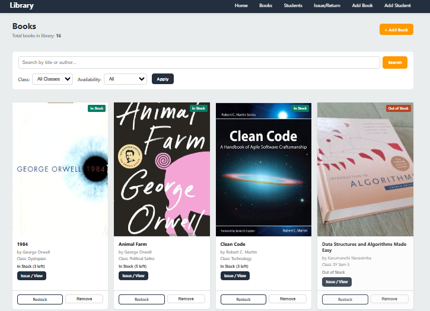
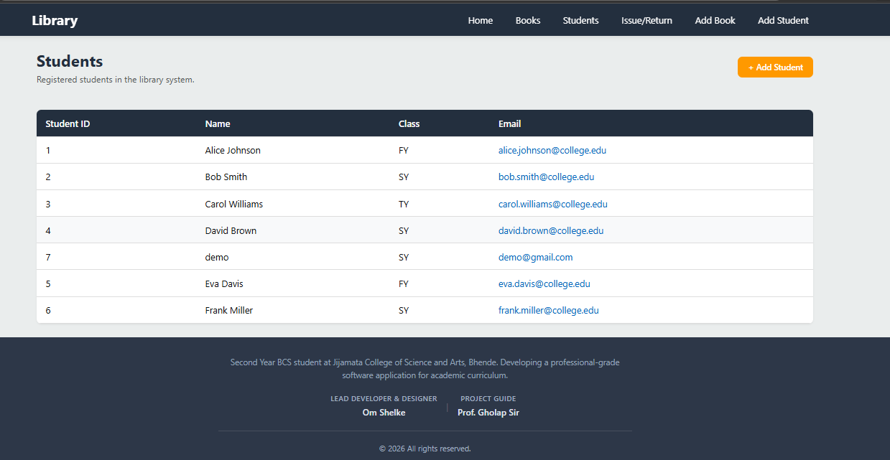
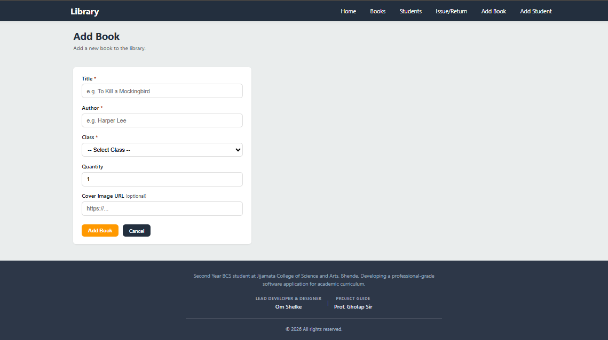
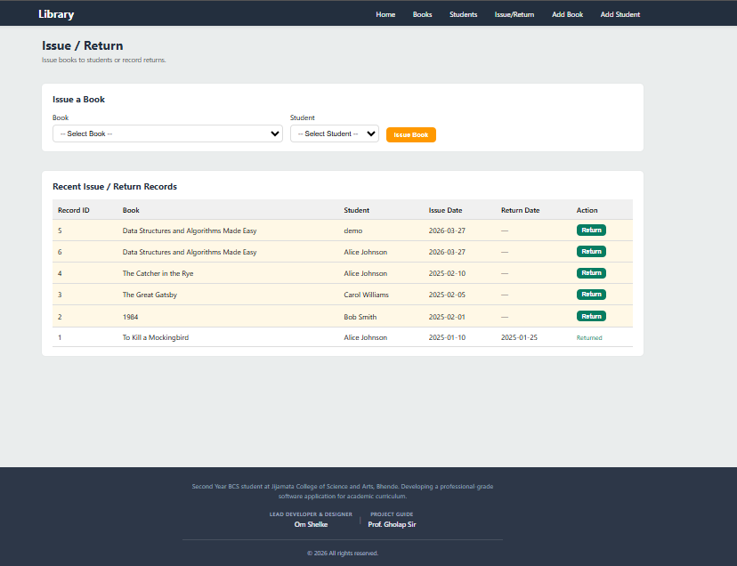
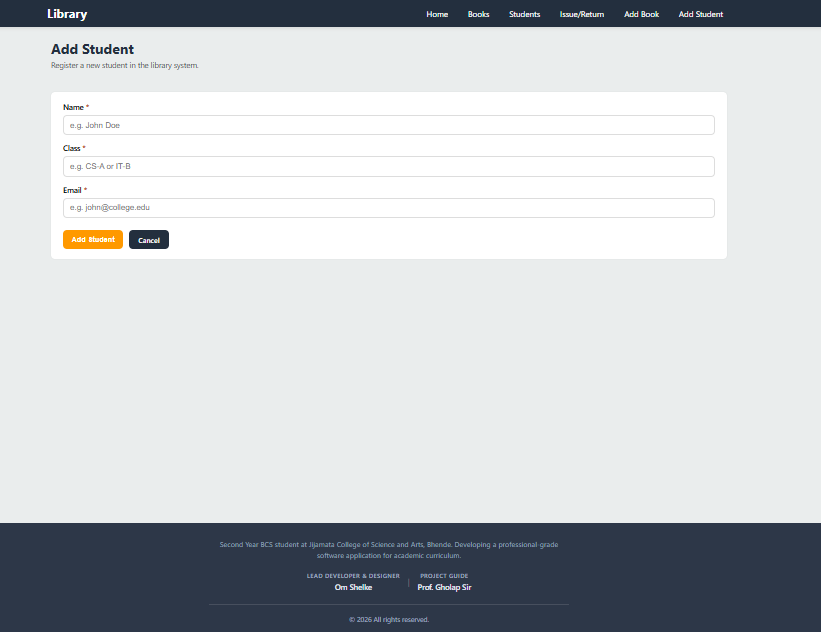

```md
# Academic Digital Library System (Flask + MySQL)

A simple and user-friendly **Digital Library Management System** built using **Flask and MySQL**.

This project is developed as a **college mini project** to manage a small academic library efficiently.  
It allows librarians to manage books, register students, and issue or return books, while automatically maintaining book stock and availability.

---

## Key Features

### Books Management
- View books in a responsive grid layout
- Search books by title or author
- Filter by class / semester and availability
- Pagination with total book count
- Add, update, restock, or remove books

### Students Management
- Register new students
- View student list
- Store student details (name, class, email)

### Issue & Return System
- Issue books to registered students
- Return issued books
- Automatic stock update on issue/return
- Prevent issuing books when stock is unavailable

---

## Tech Stack

- Frontend: HTML5, CSS3 (Grid and Flexbox, Responsive UI)
- Backend: Python, Flask
- Database: MySQL

---

## Project Structure

```

Digital-Library-System/
├── app.py
├── config.py
├── database.py
├── requirements.txt
├── README.md
├── PROJECT_EXPLANATION_FOR_TEACHERS.txt
├── database/
│   ├── schema.sql
│   └── seed_data.sql
├── templates/
│   ├── base.html
│   ├── books.html
│   ├── restock.html
│   ├── students.html
│   ├── add_book.html
│   ├── add_student.html
│   └── issue_return.html
└── static/
└── css/
└── style.css

```

---

## Installation and Setup

### Database Setup (MySQL)

Run the following commands:

```

mysql -u root -p < database/schema.sql
mysql -u root -p library_db < database/seed_data.sql

```

You can also execute these files using MySQL Workbench or phpMyAdmin.

---

### Python Setup

Create and activate a virtual environment:

```

python -m venv venv
venv\Scripts\activate

```

Install dependencies:

```

pip install -r requirements.txt

```

---

### Configuration (Optional)

You can configure the application using environment variables:

- MYSQL_HOST  
- MYSQL_USER  
- MYSQL_PASSWORD  
- MYSQL_DATABASE  
- SECRET_KEY  

If these are not set, default values from config.py will be used.

---

## Running the Application

```

python app.py

```

Open the application in a browser at:

```

[http://127.0.0.1:5000](http://127.0.0.1:5000)

```

---

## Screenshots

Create the following folder structure:

```

docs/
└── screenshots/
├── books.png
├── students.png
├── add_book.png
├── issue_return.png
└── restock.png

```

Add screenshots in the README using:

```







```

---

## Author and Academic Details

- Student Name: Om Shelke  
- Project Guide: Prof. Gholap Sir  
- College: Jijamata College of Science and Arts, Bhende  
- Course: B.Sc / BCA / Computer Science (Mini Project)

---

## Academic Disclaimer

This project is created for educational purposes as a college mini project.  
It is not intended for production use without proper security improvements such as authentication, input validation, and secure configuration.

---

## Future Enhancements

- Admin or Librarian authentication
- Book reservation system
- Fine calculation for late returns
- Export reports (CSV or PDF)
- UI enhancement using Bootstrap or Tailwind CSS
```

This version contains no emojis and no conversational filler text.
You can copy and paste it directly into `README.md`.
